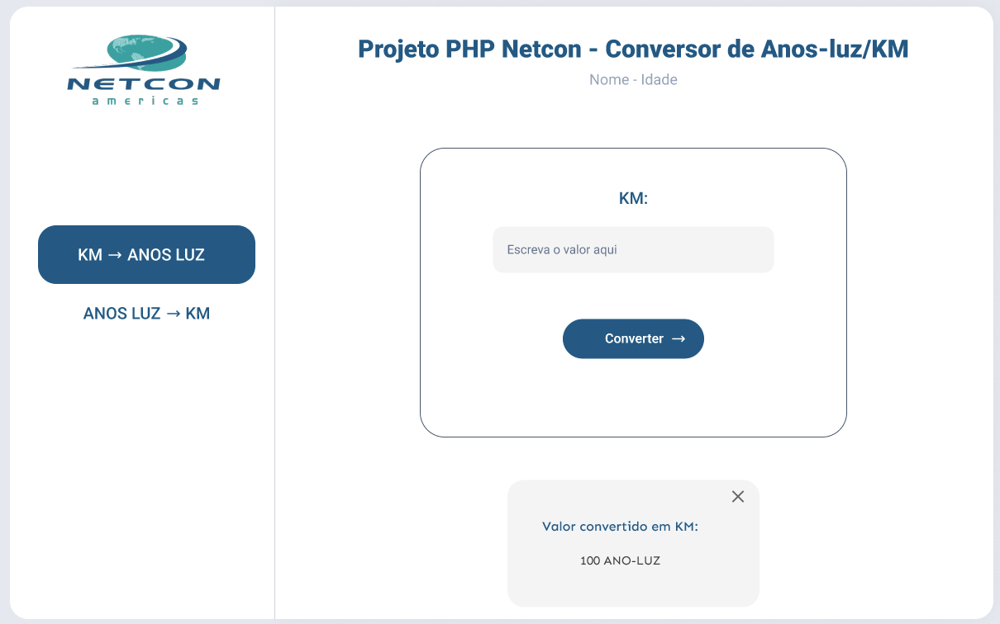
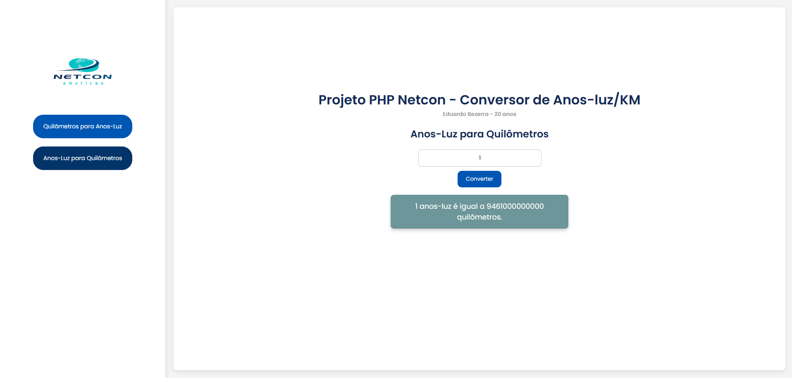

<h1 align="center">
  Desafio Netcon - Conversor de Anos-Luz/KM
</h1>

## Condições

> Este projeto é uma aplicação web desenvolvida em Laravel que permite a conversão de valores entre quilômetros (KM) e anos-luz, conforme os requisitos definidos no desafio do processo seletivo.  
> A aplicação está dividida em **frontend** e **backend**, sendo o backend uma **API REST** com dois endpoints para realizar as conversões. O frontend apresenta uma interface com um menu lateral para alternar entre as duas opções de conversão, e os resultados são exibidos na tela em um popup estilizado.

> Este projeto foi desenvolvido como parte do desafio para vaga de Estagiário de Desenvolvimento de Software na Netcon Americas (Recife - Pe).


---

## Tecnologias utilizadas

```PHP 8```
```Laravel```
```Blade```
```CSS e JavaScript```

---

## **Requisitos do Desafio**

### **Frontend**
1. **Tela de conversão de KM para anos-luz**
   - Input para inserir valores em quilômetros.
   - Botão para realizar a conversão.
   - Validação para aceitar apenas valores numéricos positivos.
   - Resultado exibido em um popup.

2. **Tela de conversão de anos-luz para KM**
   - Input para inserir valores em anos-luz.
   - Botão para realizar a conversão.
   - Validação para aceitar apenas valores numéricos positivos.
   - Resultado exibido em um popup.

3. **Menu lateral**
   - Alternar entre as telas de conversão.

### **Backend (API)**
1. **Endpoint POST `/quilometros`**
   - Recebe um valor numérico positivo em quilômetros.
   - Retorna o valor convertido em anos-luz com no máximo 4 casas decimais.
   - Validação para rejeitar valores não numéricos ou negativos.
   - Status code 200 OK em casos de sucesso.
   - Status code 400 ERROR em casos de erro.

2. **Endpoint POST `/anosLuz`**
   - Recebe um valor numérico positivo em anos-luz.
   - Retorna o valor convertido em quilômetros com no máximo 4 casas decimais.
   - Validação para rejeitar valores não numéricos ou negativos.
   - Status code 200 OK em casos de sucesso.
   - Status code 400 ERROR em casos de erro.
   

---

## Como Executar

### Pré-requisitos

- PHP >= 8.1
- Composer

### Configuração

- Clone o repositório:
```bash
$ git clone https://github.com/duutheboy/desafio-php-netcon
$ cd desafio-php-netcon
```
- Instale as dependências do Laravel:
```bash
$ composer install
```
- Inicie o servidor:
```bash
$ php artisan serve
```
A aplicação estará disponível em http://localhost:8000 e http://127.0.0.1:8000

---

## API Endpoints

1. **Quilômetros para Anos-Luz**
    - Endpoint:
    ```POST  /api/quilometros```
    - Corpo da requisição:
     ```
     {
        "quilometros": "1234567890"
     }
    ```
    - Exemplo de resposta com status 200:
    ```
     {
        "anosLuz": "0.0001"
     }
    ```
2.  **Anoz-Luz para Quilômetros**
    - Endpoint:
    ```POST /api/anosLuz```
    - Corpo da requisição:
     ```
     {
        "anoLuz": "0.0001"
     }
    ```
    - Exemplo de resposta com status 200:
    ```
     {
        "quilometros": 1234567890
     }
    ```   
3. **Erro (padrão)**
    - Exemplo de erro com status 400:
    ```
     {
        "erro": "parametros invalidos"
     }
    ```
---
## Comparação entre Mockup e Projeto Realizado

### **Mockup Fornecido**


### **Projeto Realizado**


---
